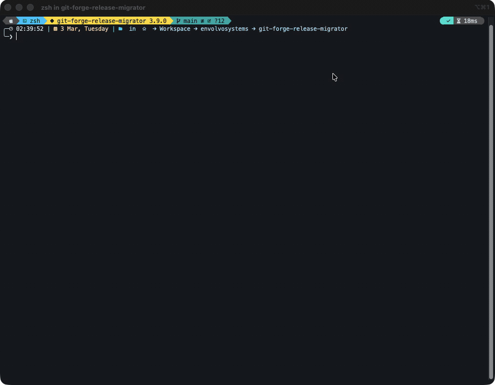
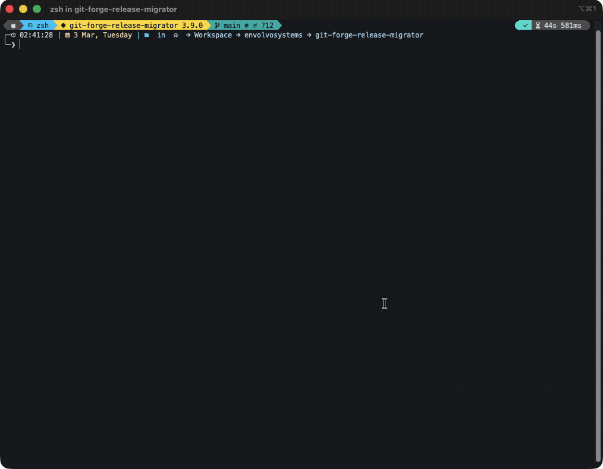

# Git Forge Release Migrator (gfrm)

[](https://www.python.org/)
[](#)
[](./release.config.cjs)

CLI em Python para migrar **tags + releases + notas de release + artefatos** entre plataformas Git.

Foi pensado para reexecução segura: itens concluídos são ignorados, itens incompletos são retomados e cada execução gera saída estruturada para auditoria e retry.

## Conteúdo

- [Matriz de Suporte](#matriz-de-suporte)
- [Requisitos](#requisitos)
- [Início Rápido](#início-rápido)
- [Comandos Copy/Paste](#comandos-copypaste)
- [Modo Demo (para gravação de GIF)](#modo-demo-para-gravação-de-gif)
- [Flags Mais Usadas](#flags-mais-usadas)
- [Saída, Retry e Sessões](#saída-retry-e-sessões)
- [Troubleshooting](#troubleshooting)

## Matriz de Suporte

| Origem | Destino | Status |
|---|---|---|
| `gitlab` | `github` | Disponível |
| `github` | `gitlab` | Disponível |
| `bitbucket` | qualquer | Registrado, ainda não implementado |

## Requisitos

| Dependência | Versão | Observação |
|---|---|---|
| Python | `>=3.9` | Necessário para executar a CLI |
| `curl` | qualquer | Usado para baixar artefatos de release |
| `gh` (GitHub CLI) | qualquer | Necessário apenas em fluxos que envolvem GitHub (origem ou destino) |

Instalar o `gh`: https://cli.github.com

## Início Rápido

1. Instalação:

```bash
pip install -e .
```

2. Executar modo interativo:

```bash
./bin/repo-migrator.py
```

3. Executar modo não interativo:

```bash
./bin/repo-migrator.py \
  --source-provider gitlab \
  --source-url "https://gitlab.com/group/project" \
  --source-token "<gitlab_pat>" \
  --target-provider github \
  --target-url "https://github.com/org/repo" \
  --target-token "<github_pat>" \
  --from-tag v3.2.1 \
  --to-tag v3.40.0
```

## Comandos Copy/Paste

```bash
# Interativo (recomendado na primeira execução)
./bin/repo-migrator.py

# Retomar última sessão
./bin/repo-migrator.py --resume-session

# Somente dry-run
./bin/repo-migrator.py --dry-run \
  --source-provider gitlab --source-url "https://gitlab.com/group/project" --source-token "<gitlab_pat>" \
  --target-provider github --target-url "https://github.com/org/repo" --target-token "<github_pat>"

# Executar somente tags com falha da execução anterior
./bin/repo-migrator.py --tags-file ./migration-results/<run>/failed-tags.txt
```

## Modo Demo (para gravação de GIF)

Use o modo demo para simular a migração sem chamadas reais de API.

```bash
./bin/repo-migrator.py \
  --demo-mode \
  --demo-releases 5 \
  --demo-sleep-seconds 1.2 \
  --source-provider gitlab \
  --source-url "https://gitlab.com/teste" \
  --source-token "foo" \
  --target-provider github \
  --target-url "https://github.com/teste" \
  --target-token "bar" \
  --non-interactive
```

| Modo | Gravação |
|---|---|
| Interativo |  |
| Não interativo |  |

## Flags Mais Usadas

- `--dry-run`: monta e valida o plano sem criar/atualizar releases.
- `--skip-tags`: migra somente releases.
- `--from-tag` / `--to-tag`: limita o intervalo de tags.
- `--tags-file <path>`: executa apenas tags específicas.
- `--release-workers <n>` e `--download-workers <n>`: ajuste de desempenho.
- `--resume-session`: carrega+salva sessão em um único comando.
- `--non-interactive`: execução totalmente scriptável.
- `--progress-bar`: progresso amigável para CI.

Referência completa da CLI: [docs/USAGE.pt-BR.md](docs/USAGE.pt-BR.md)

## Saída, Retry e Sessões

Cada execução grava em:

```text
./migration-results/<YYYYMMDD-HHMMSS>/
```

Arquivos gerados:

- `migration-log.jsonl`
- `summary.json`
- `failed-tags.txt`

Padrões de sessão:

- arquivo de sessão: `./sessions/last-session.json`
- modo de token: `env` (recomendado; não grava token em texto puro)

## Modelo de Segurança

- Migração de tags ocorre antes da migração de releases.
- Release completa já existente é ignorada.
- Release incompleta existente é retomada/atualizada.
- Se source archives falharem, links de fallback podem preservar rastreabilidade.
- Tokens nunca são impressos em log.

Para operações com GitHub, o comando é sempre executado como:

```bash
GH_TOKEN="<target_token>" gh ...
```

## Troubleshooting

- `gh: Bad credentials (HTTP 401)` com `--dry-run`:
  - O dry-run ainda valida o estado das releases no destino, então o token de destino precisa ser válido.
- `pip install -e .[dev]` falha no `zsh`:
  - Use aspas: `pip install -e '.[dev]'`.

## Setup para Desenvolvimento

```bash
pip install -e '.[dev]'
./scripts/install-hooks.sh
```

Hooks configurados:

- `pre-commit`: lint + verificação de formatação
- `commit-msg`: validação de mensagem com Commitizen
- `pre-push`: suíte completa de testes

Rodar testes manualmente:

```bash
python3 -m unittest discover -s tests -p 'test_*.py'
```

## Processo de Release (deste projeto)

Este repositório usa `semantic-release` + GitHub Actions na branch `main`.

- Conventional Commits definem o bump de versão.
- Nova tag `vX.Y.Z` é criada automaticamente.
- GitHub Release e changelog são gerados.

Veja: [CHANGELOG.md](CHANGELOG.md), [release.config.cjs](release.config.cjs), [.github/workflows/release.yml](.github/workflows/release.yml)

## Documentação

- Referência completa da CLI e opções avançadas: [docs/USAGE.pt-BR.md](docs/USAGE.pt-BR.md)
- README em inglês: [README.md](README.md)
